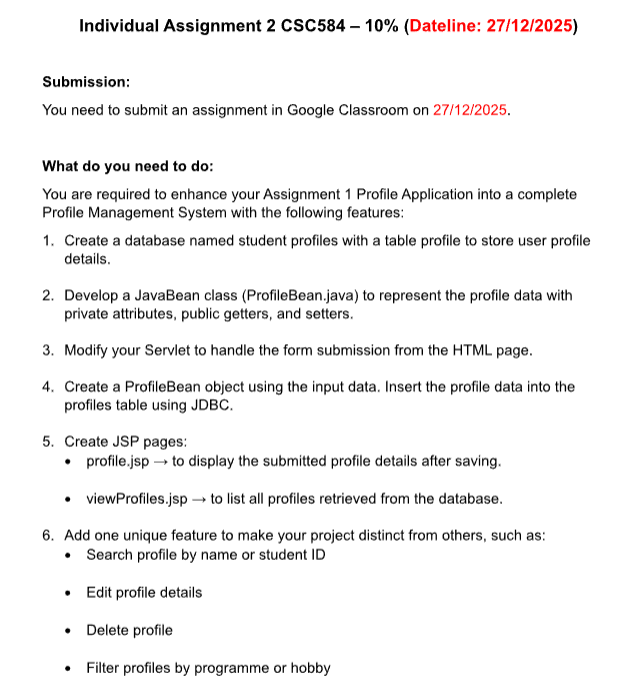
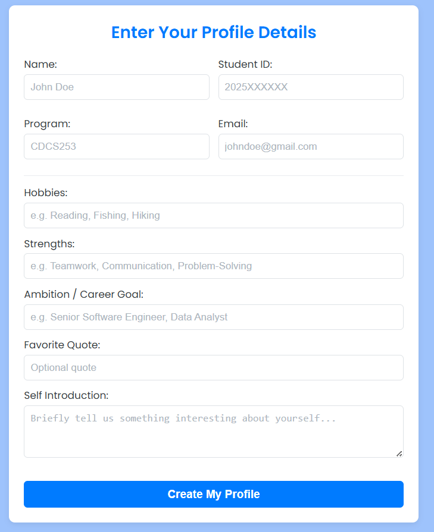
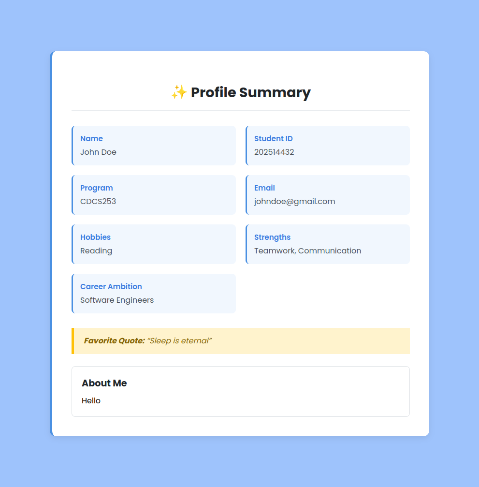
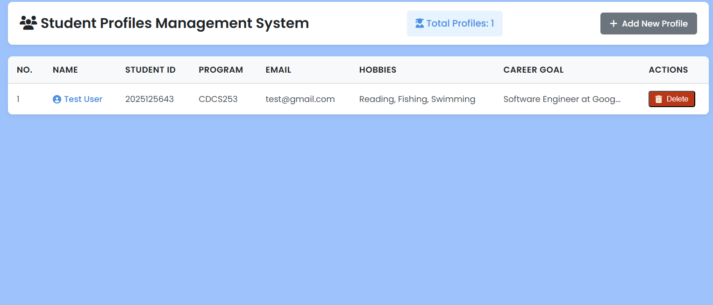

# Individual Assignment 2 CSC584

This is an update to my individual assignment on building a complete profile management system.

## Quick Overview

**What does this project do?**

The project work as the same but now added the functionality to view all profiles and it even has delete features! the data is being stored persistently in database.

## Showcase

